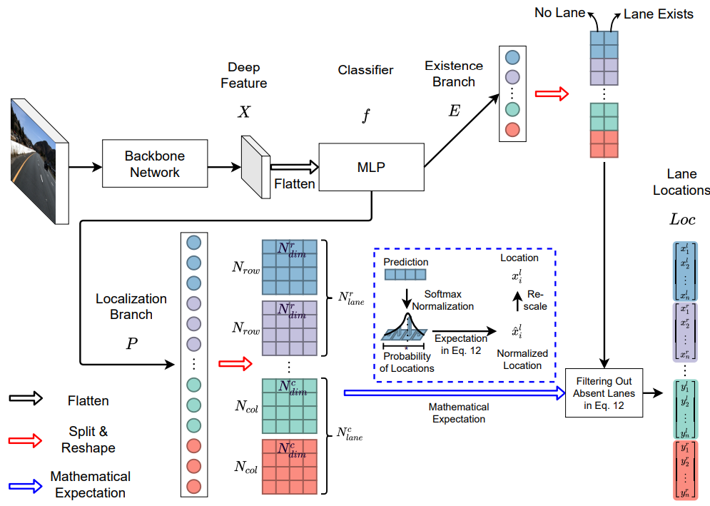

# Ultra-Fast-Lane-Detection-V2
PyTorch implementation of the paper "[Ultra Fast Deep Lane Detection with Hybrid Anchor Driven Ordinal Classification](https://arxiv.org/abs/2206.07389)".




# Demo 
<a href="https://youtu.be/VkvpoHlaMe0
" target="_blank"></a>


# Install
Please see [INSTALL.md](./INSTALL.md)

# Get started
Please modify the `data_root` in any configs you would like to run. We will use `configs/culane_res18.py` as an example.

To train the model, you can run:
```
python train.py configs/culane_res18.py --log_path /path/to/your/work/dir
```
or
```
python -m torch.distributed.launch --nproc_per_node=8 train.py configs/culane_res18.py --log_path /path/to/your/work/dir
```
It should be noted that if you use different number of GPUs, the learning rate should be adjusted accordingly. The configs' learning rates correspond to 8-GPU training on CULane and CurveLanes datasets. **If you want to train on CULane or CurveLanes with single GPU, please decrease the learning rate by a factor of 1/8.** On the Tusimple, the learning rate corresponds to single GPU training.
# Trained models
We provide trained models on CULane, Tusimple, and CurveLanes.

| Dataset    | Backbone | F1   | Link |
|------------|----------|-------|------|
| CULane     | ResNet18 | 75.0  |  [Google](https://drive.google.com/file/d/1oEjJraFr-3lxhX_OXduAGFWalWa6Xh3W/view?usp=sharing)/[Baidu](https://pan.baidu.com/s/1Z3W4y3eA9xrXJ51-voK4WQ?pwd=pdzs)    |
| CULane     | ResNet34 | 76.0  |   [Google](https://drive.google.com/file/d/1AjnvAD3qmqt_dGPveZJsLZ1bOyWv62Yj/view?usp=sharing)/[Baidu](https://pan.baidu.com/s/1PHNpVHboQlmpjM5NXl9IxQ?pwd=jw8f)   |
| Tusimple   | ResNet18 | 96.11 |   [Google](https://drive.google.com/file/d/1Clnj9-dLz81S3wXiYtlkc4HVusCb978t/view?usp=sharing)/[Baidu](https://pan.baidu.com/s/1umHo0RZIAQ1l_FzL2aZomw?pwd=6xs1)   |
| Tusimple   | ResNet34 | 96.24 |   [Google](https://drive.google.com/file/d/1pkz8homK433z39uStGK3ZWkDXrnBAMmX/view?usp=sharing)/[Baidu](https://pan.baidu.com/s/1Eq7oxnDoE0vcQGzs1VsGZQ?pwd=b88p)   |
| CurveLanes | ResNet18 | 80.42 |   [Google](https://drive.google.com/file/d/1VfbUvorKKMG4tUePNbLYPp63axgd-8BX/view?usp=sharing)/[Baidu](https://pan.baidu.com/s/1jCqKqgSQdh6nwC5pYpYO1A?pwd=urhe)   |
| CurveLanes | ResNet34 | 81.34 |   [Google](https://drive.google.com/file/d/1O1kPSr85Icl2JbwV3RBlxWZYhLEHo8EN/view?usp=sharing)/[Baidu](https://pan.baidu.com/s/1fk2Wg-1QoHXTnTlasSM6uQ?pwd=4mn3)   |

For evaluation, run
```Shell
mkdir tmp

python test.py configs/culane_res18.py --test_model /path/to/your/model.pth --test_work_dir ./tmp
```

Same as training, multi-gpu evaluation is also supported.
```Shell
mkdir tmp

python -m torch.distributed.launch --nproc_per_node=8 test.py configs/culane_res18.py --test_model /path/to/your/model.pth --test_work_dir ./tmp
```

# Visualization
We provide a script to visualize the detection results. Run the following commands to visualize on the testing set of CULane.
```
python demo.py configs/culane_res18.py --test_model /path/to/your/culane_res18.pth
```

# Tensorrt Deploy
We also provide a python script to do tensorrt inference on videos.

1. Convert to onnx model
    ```
    python deploy/pt2onnx.py --config_path configs/culane_res34.py --model_path weights/culane_res34.pth
    ```
    Or you can download the onnx model using the following script: https://github.com/PINTO0309/PINTO_model_zoo/blob/main/324_Ultra-Fast-Lane-Detection-v2/download.sh. And copy `ufldv2_culane_res34_320x1600.onnx` to `weights/ufldv2_culane_res34_320x1600.onnx`

2. Convert to tensorrt model

    Use trtexec to convert engine model

    `trtexec --onnx=weights/culane_res34.onnx --saveEngine=weights/culane_res34.engine`

3. Do inference
    ```
    python deploy/trt_infer.py --config_path  configs/culane_res34.py --engine_path weights/culane_res34.engine --video_path example.mp4
    ```

# Citation

```BibTeX
@InProceedings{qin2020ultra,
author = {Qin, Zequn and Wang, Huanyu and Li, Xi},
title = {Ultra Fast Structure-aware Deep Lane Detection},
booktitle = {The European Conference on Computer Vision (ECCV)},
year = {2020}
}

@ARTICLE{qin2022ultrav2,
  author={Qin, Zequn and Zhang, Pengyi and Li, Xi},
  journal={IEEE Transactions on Pattern Analysis and Machine Intelligence}, 
  title={Ultra Fast Deep Lane Detection With Hybrid Anchor Driven Ordinal Classification}, 
  year={2022},
  volume={},
  number={},
  pages={1-14},
  doi={10.1109/TPAMI.2022.3182097}
}
```
